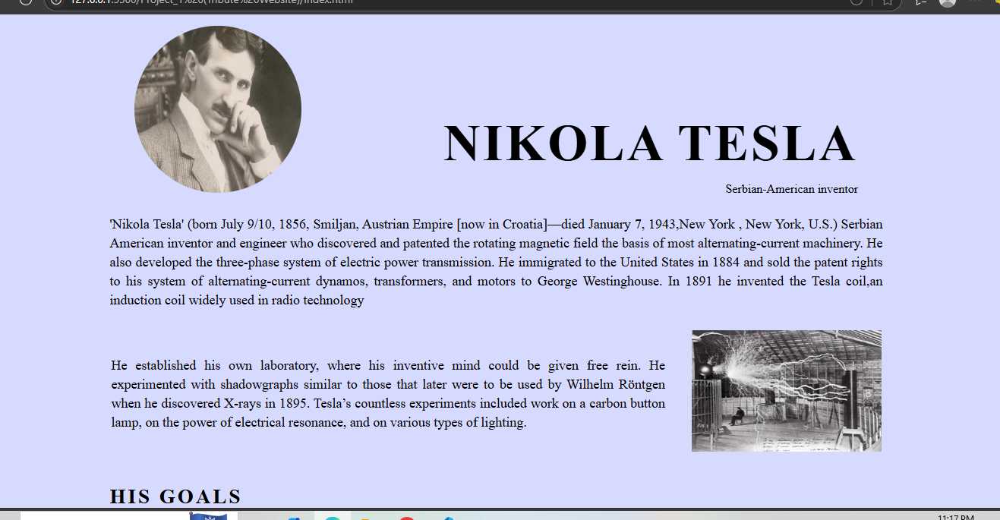

# Tribute Website – Nikola Tesla ⚡

A responsive tribute webpage dedicated to Nikola Tesla, built with HTML and CSS.

## 📌 Features

- Flexbox-based responsive layout
- Glassy tribute design with image and biography
- Tabular content with image and text
- Lists of Tesla's notable contributions
- Responsive design with mobile support via media queries

## 🖼️ Screenshot



## 📁 Folder Structure
```
/tribute-website/
│
├── index.html
├── style.css
├── /photos
│ ├── nikola_img.png
│ └── nikolaLab.png.webp
│ └── image.png
```
## 🛠️ Tech Stack

- HTML5
- CSS3 (Flexbox, Media Queries)

## 📜 License

Free to use for educational or non-commercial purposes.