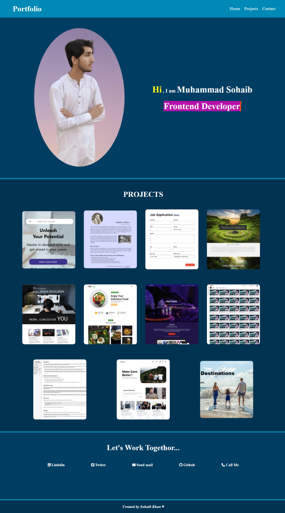

# Personal Portfolio — _Muhammad Sohaib_

This is a personal portfolio website designed to showcase my frontend development projects and skills. The site is built using HTML, CSS, and JavaScript with smooth animations using GSAP.

## Features

- Responsive navigation with mobile menu
- Hero section with animated name intro
- Project cards with hover effects
- Contact section with real links
- Smooth GSAP animations

## Technologies Used

- HTML5
- CSS3
- JavaScript (Vanilla)
- GSAP (GreenSock Animation Platform)
- Font Awesome / Remix Icons

## Screenshot

## Project Structure

- `index.html` – Main HTML structure
- `style.css` – Custom styling and responsive design
- `script.js` – JavaScript logic and animations
- `/photos` – Image assets for the hero and projects

## Contact
- 

- [LinkedIn](https://www.linkedin.com/in/sohaibkundi2)  
- [GitHub](https://github.com/sohaibkundi2)  
- [Email](mailto:sohaibkundi2@gmail.com)  
- [Phone](tel:+923350532352)
