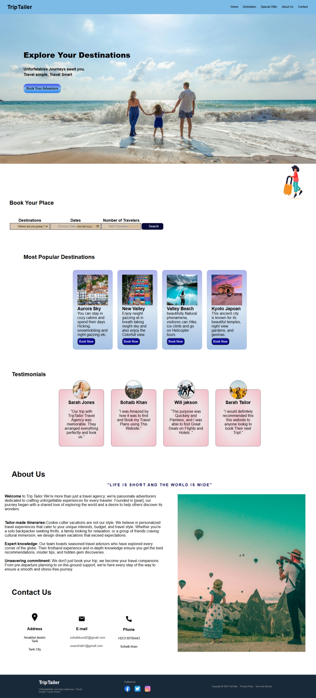

# TripTailer 

TripTailer is a travel website landing page that allows users to explore destinations, book trips, and view testimonials — all within a visually appealing and responsive design.

## Features

-  Hero section with bold tagline and CTA
-  Booking form with destination, date, and number of travelers
-  Highlighted popular destinations
-  Customer testimonials
-  About Us section
-  Contact section with address, email, and phone

## screenshot

## Tech Stack

- HTML5
- CSS3

## Author

- Muhammad Sohaib  
- [GitHub](https://github.com/sohaibkundi2) | [LinkedIn](https://www.linkedin.com/in/sohaibkundi2)

