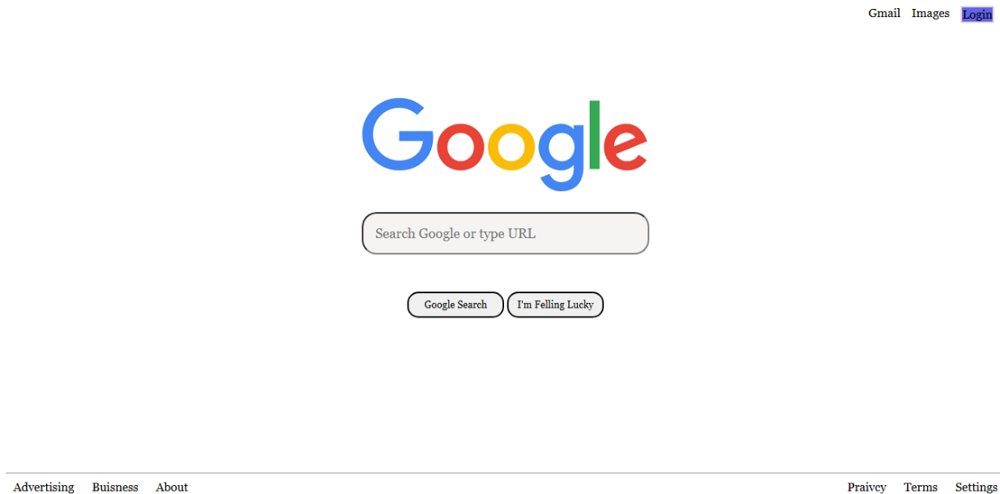

# Google Homepage Clone

This is a simple clone of the classic [Google.com](https://www.google.com) homepage built using **HTML** and **CSS**.

## Features

-  Google logo and layout styling
-  Search bar with placeholder
-  “Google Search” and “I’m Feeling Lucky” buttons
-  Header links: Gmail, Images, and Login
-  Footer links: Advertising, Business, About, Privacy, Terms, and Settings
-  Login button styled differently with hover effect and redirect to **login page**

## Tech Stack

- HTML5
- CSS3

# Screenshot

