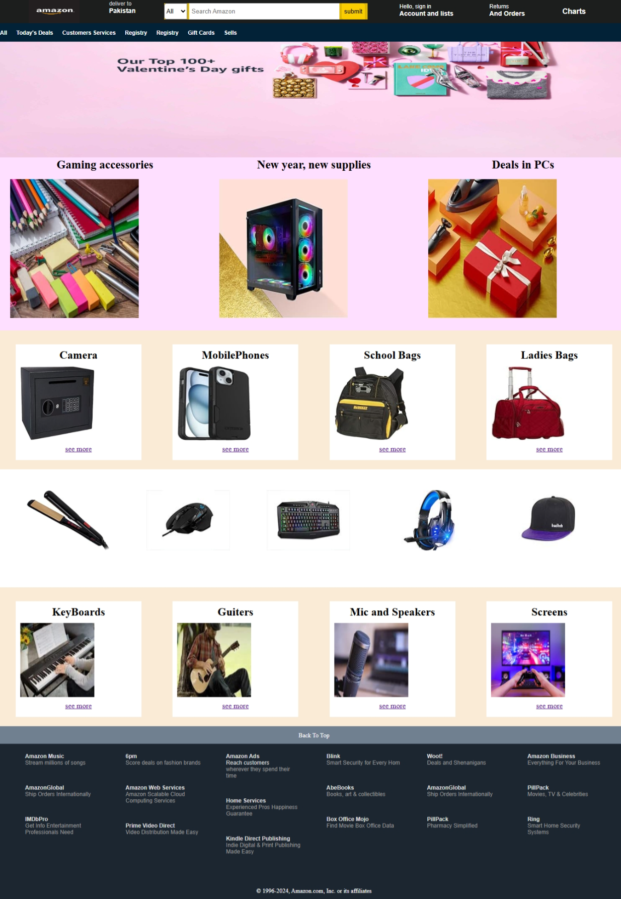

#  Amazon Clone (HTML & CSS)

This is a beginner-friendly Amazon Clone created using only **HTML and CSS**. The project replicates the basic structure and layout of the Amazon homepage for desktop screens.

---

##  Features

- Custom navigation bar with Amazon logo, search bar, and user account area
- Second-level navigation menu for categories
- Hero section with a banner image
- Product sections with images and titles
- Simple footer with multiple columns and links
- Clean and structured HTML with organized CSS
- Border hover effect for interactivity

---

##  Screenshots

---

---

##  Notes

- **This version is not responsive.** It is designed for learning layout and structure first.
- Will improve this with responsiveness and interactivity in future updates.

---

##  Author

- Muhammad Sohaib  
- Gomal University, Sub Campus Tank  
- [GitHub Profile](https://github.com/sohaibkundi2) 

---

