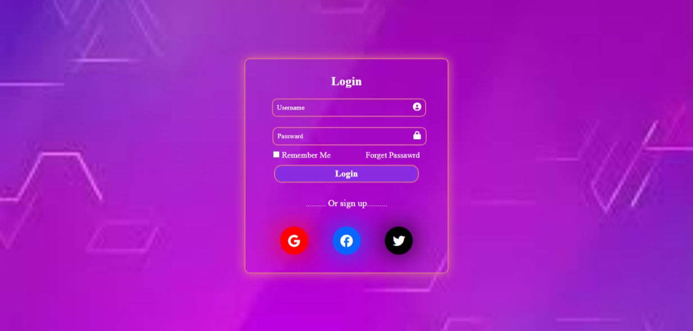

# Glassmorphism Login Form

This project is a modern, stylish Login Form created using HTML, CSS, and Font Awesome icons. It includes a clean glassmorphism effect, responsive layout, and social login options.

---

## Features

- Glassmorphism-inspired UI
- Username and password input fields with icons
- "Remember me" checkbox
- "Forgot password" link
- Social login options: Google, Facebook, Twitter
- Clean UI and hover effects

---

## Preview



---

## Technologies Used

- HTML5
- CSS3
- Font Awesome (CDN)

---

## Folder Structure

```
project_15 (Login Page)/
│
├── index.html
├── style.css
├── image.png
└── 3.jpeg (background image)
```

---

## Notes

- This is a front-end only UI. No JavaScript or backend validation is included yet.
- The layout uses grid and flexbox.
- The glassmorphism effect uses `backdrop-filter`, which works in modern browsers.

---

## Author

- **Muhammad Sohaib**
- BS Computer Science, Gomal University Sub Campus Tank
- GitHub: [sohaibkundi2](https://github.com/sohaibkundi2)

---

## Project Status

This is the first version of the login form. It will be improved with mobile responsiveness, validation, and backend connectivity in future versions.

