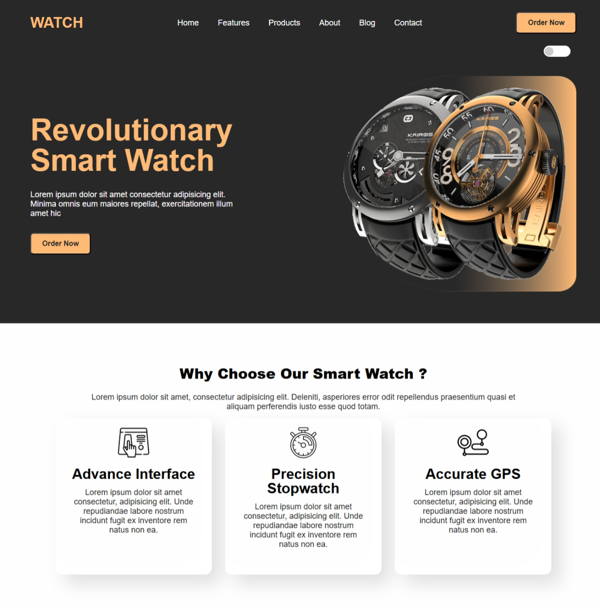

# Smart Watch Landing Page

This is a modern and stylish landing page for a Smart Watch product. It is built using **HTML, CSS**, and a small **JavaScript theme toggle** for dark and light mode. The design is clean, responsive, and includes animated UI elements.

---

## Features

- Fully responsive layout using Flexbox and Media Queries
- Toggle between dark and light theme using JavaScript
- Custom primary and theme-based color variables with `:root`
- Animated buttons and hover effects
- Two full-page sections:
  - **Hero Section** with image and CTA
  - **Features Section** with cards
- Mobile navigation simplification (center nav hidden on small screens)

---

---

## Technologies Used

- HTML5
- CSS3 with custom variables
- JavaScript (for theme switching)
- Responsive design using media queries

---
## Preview

## How to Use

1. Clone or download the repository
2. Open `index.html` in any modern browser
3. Click the toggle in the top-right corner to change themes

---

## Author

- **Muhammad Sohaib**
- BSCS - Gomal University, Sub Campus Tank
- GitHub: [sohaibkundi2](https://github.com/sohaibkundi2)

---

## Project Status

- Version 1 completed
- Theme switcher and responsiveness added
- Future plans:  contact form

