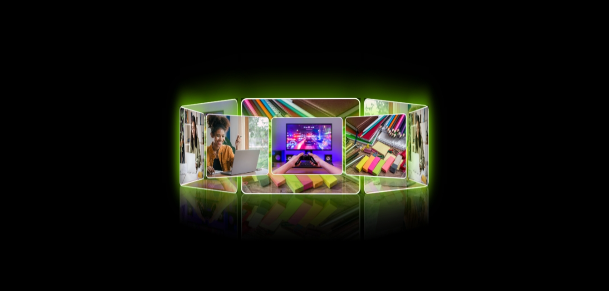

#  Rotating Cards – Project 17

This project features a 3D rotating carousel of image cards using **HTML**, **CSS**, and a bit of **JavaScript**. It's a creative animation-based UI that showcases image rotation in 3D space with lighting effects and reflections.

---

## 📸 Live Preview

****

---

## ✨ Features

- 3D rotation using `perspective` and `rotateY`
- Smooth `@keyframes` animation
- Reflective effects with `-webkit-box-reflect`
- Clean layout and centered design
- Responsive design ready (can be improved further)

---

## 🛠️ Built With

- **HTML5**
- **CSS3** (with `transform`, `box-shadow`, `animation`)

---

---

## 👨‍💻 Author

**Sohaib Kundi**  
Frontend Developer | UI/UX Learner  
[GitHub](https://github.com/sohaibkundi2) • [LinkedIn](https://linkedin.com/in/sohaibkundi2)

> “Practice makes progress — every project takes me one step further.”

---

