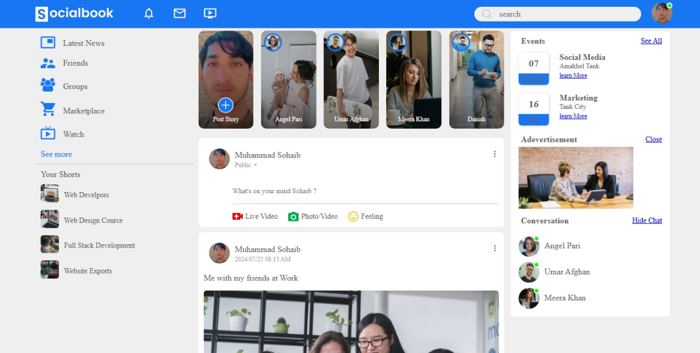

# Facebook Clone 🔵 | project_19

A responsive Facebook clone built using **HTML**, **CSS**, and **JavaScript**. This project replicates Facebook’s layout and core UI features including the navbar, sidebar, posts, story section, profile, and dark mode toggle.

## 📸 Demo



## 🚀 Features

- 🔹 Facebook-like UI with header, profile & post sections
- 🔹 Dark mode toggle with persistent theme (localStorage)
- 🔹 Responsive layout for desktop & mobile
- 🔹 Interactive elements (search, posts, settings menu)
- 🔹 Profile and Home page versions included

## 🛠️ Built With

- **HTML5**
- **CSS3**
- **Vanilla JavaScript**
- **Remix Icon CDN**

## 📂 Folder Structure
```
project_19 (facebook clone)/
│
├── index.html
├── profile.html
├── style.css
├── script.js
└── images/
└── readme.md/
└── image.png/
```
 ## Preview
- 📱 Mobile Responsive View

- 🌙 Dark Mode Toggle

- 👤 Profile Page Simulation

### Auther
 Author

- **Muhammad Sohaib**
- [Github](https://github.com/SohaibKundi)