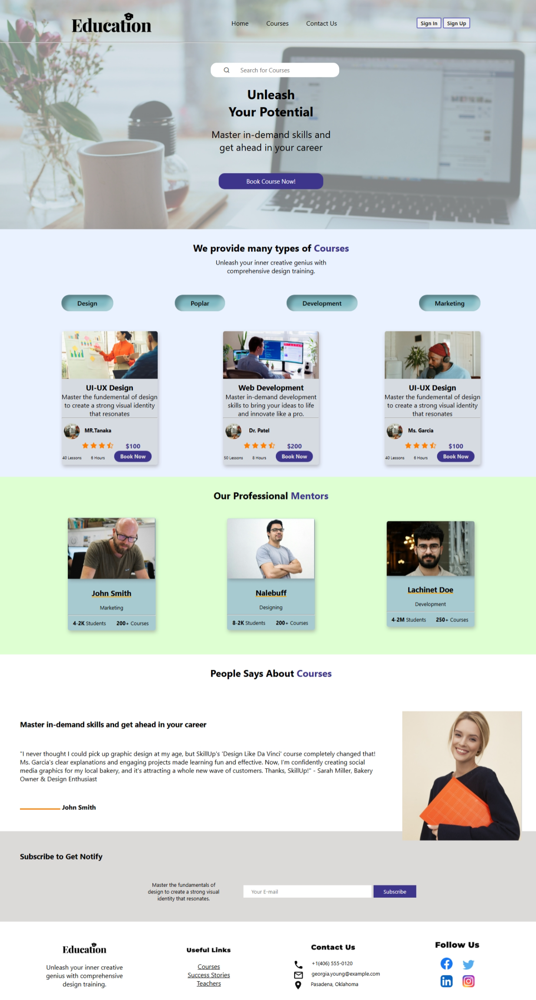

# 🎓 Education Learning Platform

A responsive, multi-page educational website that offers a clean and engaging user experience. Built with **HTML**, **CSS**, and **JavaScript**, this platform allows users to browse courses, view mentor profiles, and register for learning programs.

---

##   Project Overview

This platform is designed as part of my **36-Week Coding Challenge** (Project #20) and simulates a modern e-learning site where users can:

- Discover in-demand courses
- View experienced mentors
- Log in or sign up
- Reach out through the contact form

---

## 🌟 Features

-  Hero section with search bar and call-to-action
-  Multiple course cards with booking options
-  Professional mentor showcase
-  Testimonial/Review section
-  Contact form with phone/email/location details
-  **Login** and **Signup** pages
-  Responsive design for all devices
-  Clean UI with hover effects and media queries

---

##  Tech Stack

- **HTML5**
- **CSS3** (with Flexbox, media queries)
- **JavaScript** (Vanilla JS)
- **Remix Icons CDN**

---
## Preview

---

##  Responsiveness

The layout adapts perfectly for:
- ✅ Desktop
- ✅ Tablet
- ✅ Mobile devices

Using custom media queries and a mobile-first approach.

---

---

##  Contact

> For suggestions, collaboration, or feedback:

- 📧 Email: sohaib@example.com  
- 🔗 GitHub: [@sohaibkundi2](https://github.com/sohaibkundi)

---

