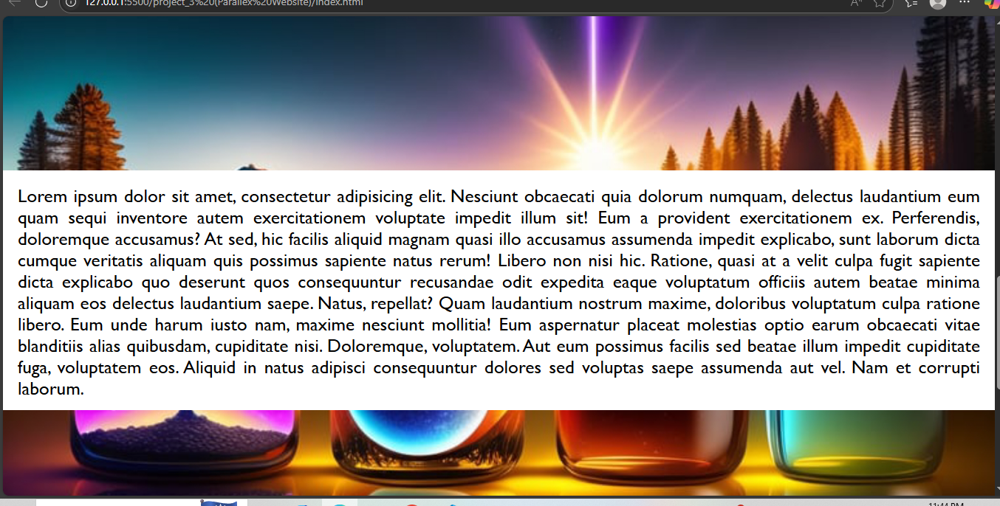

# Nature-Themed Section Layout (Parallex Website)🌿

A visually appealing, responsive multi-section web page designed using HTML and CSS. Each section highlights scenic nature backgrounds with parallax-style fixed attachments.

## 🚀 Live Preview
- live preview will availabe soom when project is upload to github

## 📌 Features

- Multiple full-screen sections with background images
- Parallax scrolling effect using `background-attachment: fixed`
- Styled headings with light and dark backgrounds
- Justified content blocks with smooth typography
- Responsive font sizing via media queries

## 🧱 Tech Stack

- HTML5
- CSS3 (Flexbox, Backgrounds, Media Queries)

## 🖼️ Screenshot



## 📁 Folder Structure
```
├── index.html
├── style.css
├── /photos
│ ├── nature-1.png
│ ├── nature-2.png
│ └── nature-3.png
└── screenshot.png
```
## 📜 License

Free to use for educational or non-commercial purposes.


## Auther
- Sohaib Khan