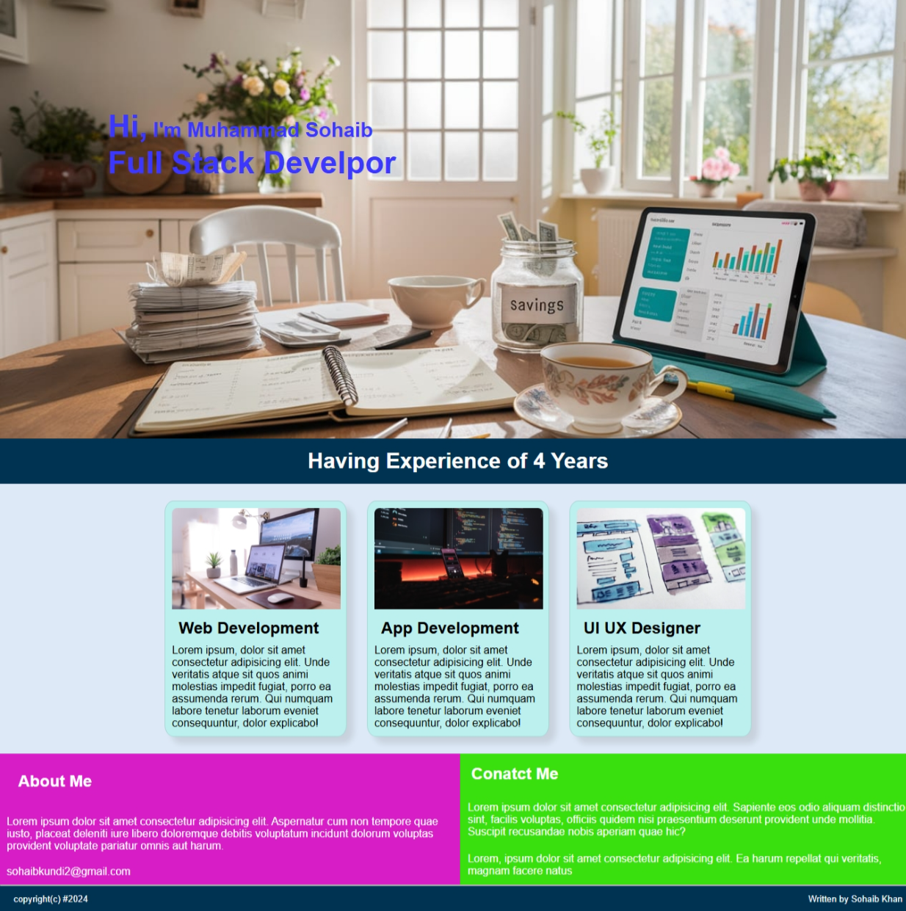

# 🌐 Developer Landing Page – Sohaib Kundi

A responsive landing page for a full-stack developer built using HTML and CSS. This project showcases services, a hero section, an about section, and contact information.

---

## 📌 Features

- Hero section with background image and greeting headline
- Responsive design with media queries
- Three service cards: Web Development, App Development, UI/UX Design
- "About Me" and "Contact Me" sections with custom background colors
- Clean footer with credits and copyright

---

## 🧱 Tech Stack

- HTML5
- CSS3 (Flexbox, Media Queries)

---

## 📁 Folder Structure

```
├── index.html
├── style.css
├── /photos
│ ├── 1.png
│ ├── 2.png
│ ├── 3.png
│ └── hero2.jpg
└── screenshot.png
```
## 📸 Screenshot



Made with 💻 by **Sohaib Kundi**