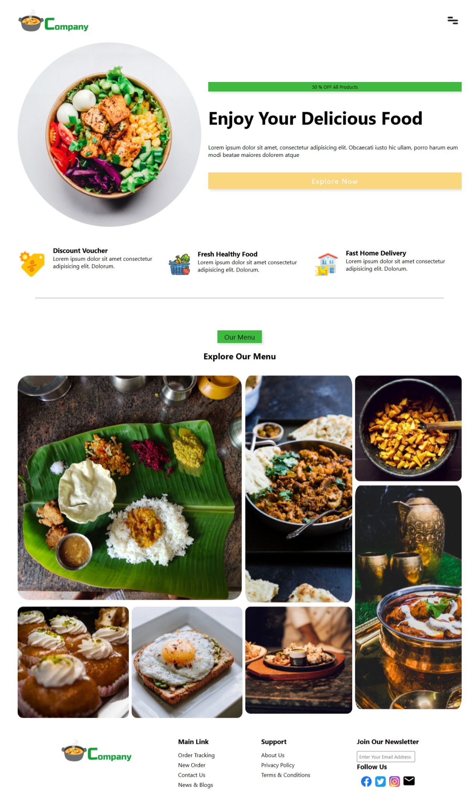

#  Restaurant Website

A modern and visually engaging restaurant landing page designed using **HTML**, **CSS**, **JavaScript**, and **GSAP** animations. This project is fully responsive and focuses on delivering a smooth user experience with visual interactivity.

---

##  Features

- **Sticky Navigation Bar** with logo and menu icon
- **Hero Section** with promotional content
- **Offer & Feature Highlights** like discount vouchers, fresh food, and fast delivery
- **Menu Gallery** using CSS Grid with hover effects
- **Footer Section** with newsletter and social links
- **Custom Cursor & Click Effects** using SVG and particles
- **GSAP Animation** for string path interaction (optional)

---

##  Technologies Used

- HTML5
- CSS3 (Flexbox + Grid + Media Queries)
- JavaScript (DOM Manipulation)
- GSAP (GreenSock Animation Platform)
- Font Awesome (for icons)

---

##  Screenshot

 Author
Muhammad Sohaib

-  sohaibkundi2@gmail.com

-  [GitHub](github.com/sohaibkundi2)
> This project is part of my frontend learning journey. Feedback and contributions are welcome!

##  Author

**Sohaib Khan**  
Frontend Developer | UI/UX Enthusiast  
[LinkedIn](https://www.linkedin.com/in/sohaibkundi2/) | [GitHub](https://github.com/sohaibkundi2)