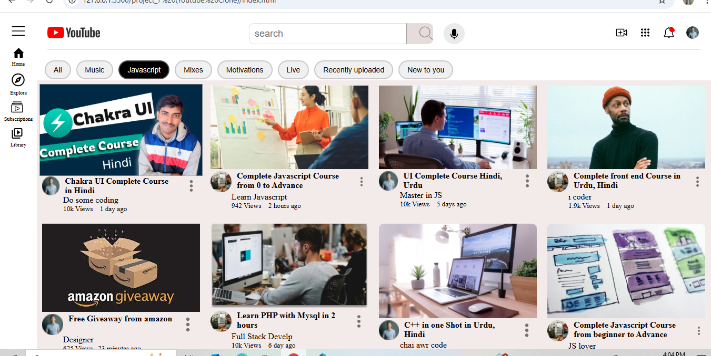

# 🎥 YouTube Clone

A responsive front-end clone of YouTube built with **HTML** and **CSS**. This project replicates the visual layout and interactivity of the YouTube homepage, including a navigation bar, sidebar, search bar, video thumbnails, and responsive tags.

## 📸 Screenshot

## 📁 Project Structure

## 📱 Responsive Design

- Mobile-friendly layout (via media queries)
- Hidden sidebar on small screens
- Adaptive font sizes and paddings

## 🛠️ Technologies Used

| Technology | Purpose            |
|------------|--------------------|
| HTML5      | Markup Structure   |
| CSS3       | Styling & Layout   |
| Flexbox    | Layout Management  |
| Media Queries | Responsiveness |

## 📚 Learning Goals

- Practice CSS Flexbox layout
- Understand YouTube’s UI structure
- Improve responsive design skills

## 👨‍💻 Author

**Sohaib Khan**  
Frontend Developer | UI/UX Enthusiast  
[LinkedIn](https://www.linkedin.com/in/sohaibkundi2/) | [GitHub](https://github.com/sohaibkundi2)

---

> ⚠️ _This project is for educational purposes only and is not affiliated with YouTube or Google._
