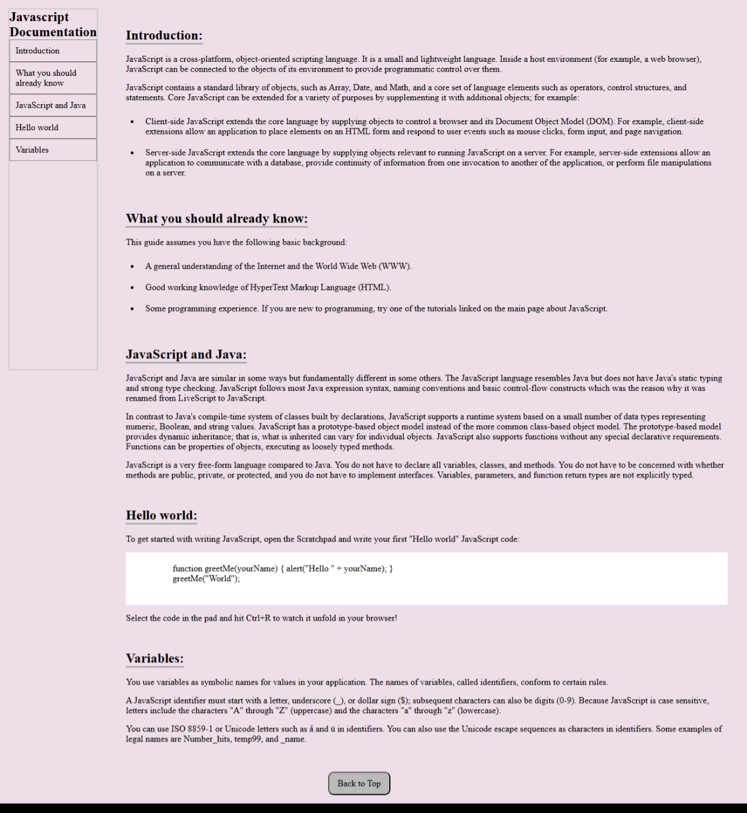

#  JavaScript Documentation Website

A beginner-friendly, responsive documentation page that mimics the structure of an MDN-like JavaScript reference. Built with **HTML** and **CSS**, this project demonstrates how to use semantic HTML, a side navigation menu, smooth scrolling, and styled content sections.

##  Features

- **Table of Contents** with internal navigation links
- Semantic sections using `<section>`, `<article>`, and `<nav>`
- Sticky-like sidebar for easy content access
- Smooth scrolling behavior
- Mobile responsive layout using media queries
- Syntax-highlight-like `pre` block for code snippets

##  Technologies Used

| Tech     | Description               |
|----------|---------------------------|
| HTML5    | Structure and layout      |
| CSS3     | Styling and responsiveness |
| Flexbox  | Layout distribution       |
| Media Queries | Mobile responsiveness |

##  Sections Included

- **Introduction**
- **What You Should Already Know**
- **JavaScript and Java**
- **Hello World Example**
- **Variables in JavaScript**

##  Screenshot

 

##  Learning Outcomes

- Understand how to structure a documentation page using HTML
- Practice Flexbox and responsive design using CSS
- Learn to build a clean developer-focused UI without JavaScript

## Author

**Sohaib Khan**  
Frontend Developer | UI/UX Enthusiast  
[GitHub](https://github.com/sohaibkundi2) | [LinkedIn](https://linkedin.com/in/sohaibkundi2)

---
