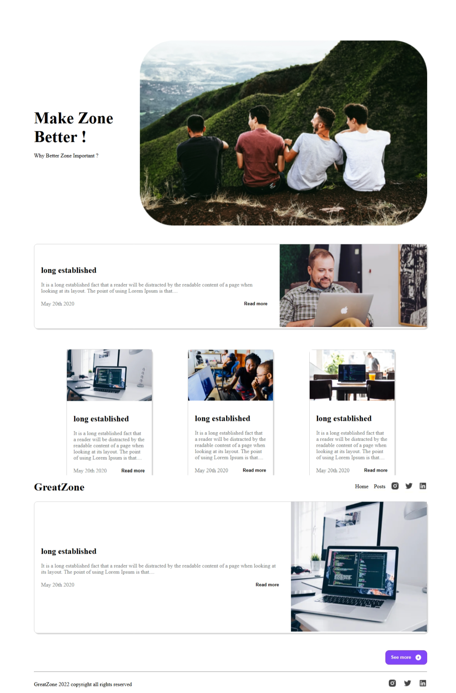

#  Blog Website - GreatZone

A simple and responsive blog homepage built using **HTML** and **CSS**. It showcases a clean layout with a hero section, featured blog posts, and a footer with social icons.

##  Features

- Modern and clean UI
- Responsive design for mobile and desktop
- Hero section with call-to-action
- Post section
- Blog cards with preview content
- Footer with social media icons

##  Technologies Used

- HTML5
- CSS3
- Media Queries for responsiveness

##  Preview

##  Author

**Muhammad Sohaib** — [GitHub Profile](https://github.com/sohaibkundi2)

